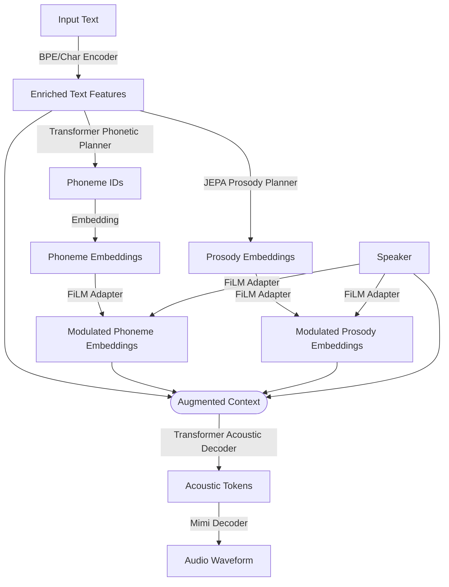

# SeedVox

SeedVox is a hybrid speech synthesis model leveraging JEPA-based prosody planning and an AR token generator.

## Quick Start (Inference)

Run inference using the latest optimized checkpoint:

```bash
python -m explicit_pros_phon_planner.infer \
    --text "Your text here" \
    --checkpoint ./checkpoints/seedvox_latest_slim_bf16.pt \
    --dtype bf16 \
    --play \
    --log_metrics \
    --device cuda
```

## Features
- **Deterministic Synthesis**: Use `--seed <INT>` for reproducible results.
- **Optimized Inference**: Supports `torch.compile` with persistent caching (`--compile`).
- **High-Resolution Visualization**: Built-in terminal-based waveform renderer.

## Conditioning Flow

The model uses a multi-modal conditioning strategy for acoustic token generation, combining semantic text features with explicit phonetic planning and speaker/prosody latents, followed by audio synthesis.



## License
This project is licensed under the Apache License 2.0. See the `LICENSE` file for details.
