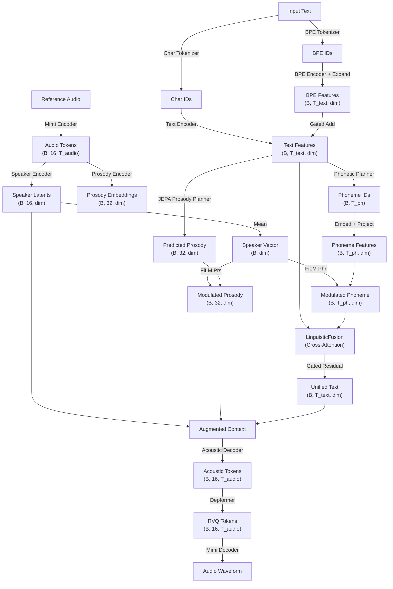

# 🌱 SeedVox

Great AI speech shouldn't just be built bigger. It should be built smarter — and it should be open for everyone to learn from.

SeedVox is a hybrid speech synthesis engine that brings structural discipline back to neural audio, designed as an educational and research sandbox for understanding how machines learn to speak. Instead of forcing a single model to juggle pronunciation, rhythm, and emotion at once, it splits the workload into three specialized components: an **AR Phonetic Planner** for phoneme prediction, a **JEPA World Model** for global prosody planning, and an **AR Acoustic Decoder** for audio token generation. This structured approach trains smarter models that require less hardware and data, making speech generation research accessible on consumer GPUs — a more elegant, frugal, and mathematically sound path to exploring how systems learn to speak.

---

## 🧠 The Motivation: From Brute-Force to Structured Speech

The TTS industry has a scaling problem. Most modern engines treat human expression like a brute-force math problem — large autoregressive decoders guess emotional state token by token. But human emotion isn't a split-second dice roll; it's a **global state of mind** that shapes an entire sentence before we even open our mouths.

By forcing a single network to calculate pronunciation, rhythm, and emotion at the same millisecond, current solutions require massive hardware clusters to overcome architectural inefficiencies.

**SeedVox solves this by introducing the world's first JEPA Prosody Planner:**

- 🧩 **The "What" (Sequential AR Planning):** A dedicated Autoregressive Transformer handles phonetics and acoustic token generation, ensuring stable, hallucination-free speech anchoring.
- 🎭 **The "How" (JEPA World Model):** A Joint-Embedding Predictive Architecture analyzes the entire semantic context at once, projecting overall expressive intent into a global latent space *before* generation begins.

---

## 🏗️ Architecture

The model follows a **fusion-based** design: text and phoneme features are fused via cross-attention before acoustic decoding, avoiding the tri-alignment problem of separate modality blocks.



### 🔑 Key Design Choices

- 🧩 **Unified Linguistic Fusion:** A gated cross-attention layer folds explicit phonemes into the text backbone *before* acoustic generation, giving the decoder a single unified representation to work with.
- 🎛️ **Dual-FiLM Disentanglement:** Independent conditioning on phonetic and prosodic streams separates vocal tract mechanics from speech rhythm. Clone a speaker's voice without bleeding in their recording environment or emotional style.
- ✍️ **Intervenable Control:** Phonemes are mapped out explicitly before audio generation. Researchers can step in, overwrite a phoneme string, and instantly correct tricky pronunciations or acronyms.

---

## ⚡ Quick Start (Inference)

```bash
python -m explicit_pros_phon_planner.infer \
    --text "Your text here" \
    --checkpoint ./checkpoints/seedvox_latest_slim_bf16.pt \
    --dtype bf16 \
    --play \
    --log_metrics \
    --device cuda
```

### 🚀 Features
- 🎯 **Deterministic Synthesis**: Use `--seed <INT>` for reproducible results.
- ⚡ **Optimized Inference**: Gradient checkpointing, Fused AdamW, and `torch.compile` keep latencies under 400ms on consumer GPUs (RTX 30/40/50 series).
- 📊 **High-Resolution Visualization**: Built-in terminal-based waveform renderer.
- 🔧 **LoRA Fine-Tuning**: Adapt the model to new voices or domains with lightweight low-rank adapters.

---

## 📄 License

Apache License 2.0. See `LICENSE` for details.

For a full technical breakdown, see [`intro_seedvox.md`](intro_seedvox.md).
