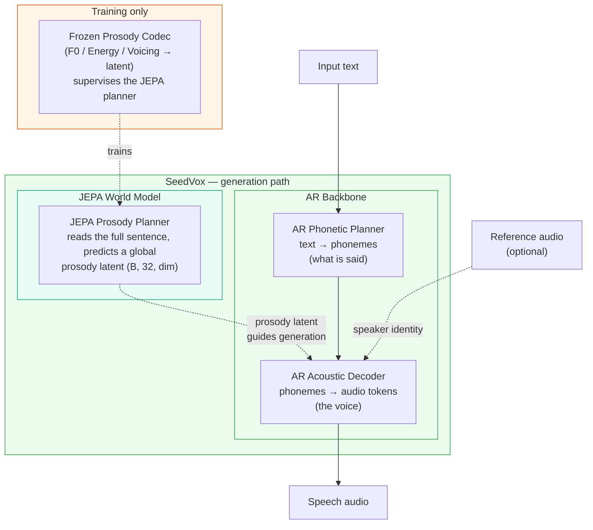
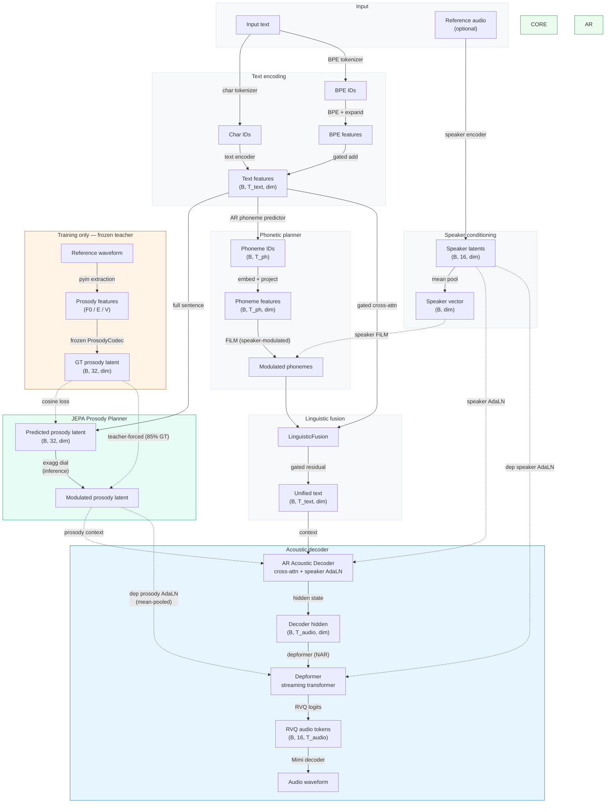

# 🌱 SeedVox

**Speech that plans before it speaks.**

Smarter Speech AI — bigger data, smarter architecture, better prosody.

Most modern speech engines treat human expression like a brute-force problem: a single, bloated
autoregressive model guesses emotion token by token. But emotion isn't a split-second dice roll —
it's a **global state of mind** that shapes an entire sentence before we even open our mouths.

**SeedVox** splits the workload into three specialized components, so each one learns a
clean job instead of juggling everything at once:

| Component | Role |
|---|---|
| **AR Phonetic Planner** | The "what" — stable, hallucination-free phoneme planning and acoustic anchoring. |
| **JEPA World Model** | The "how" — reads the whole sentence at once and predicts a global prosody latent before generation begins. |
| **AR Acoustic Decoder** | The voice — turns text and the prosody plan into audio tokens, guided by the JEPA latent. |

---

## The results

The JEPA world model plans prosody *before* the decoder runs. The decoder then conditions on that
plan and generates speech that actually follows it. Measured across 200 evaluation batches (2,000 sentences):

| Metric | Value | What it means |
|---|---|---|
| `ar` | **1.070** | Audio quality with *ground-truth* prosody — the best-case ceiling. |
| `gen_ar` | **1.070** | Audio quality with a *JEPA-sampled* plan — same as the ceiling. |
| `gen_cos` | **0.237** | How close the sampled plan lands to ground truth (0 = identical, 1 = unrelated). |
| `gen_cycle` | **0.317** | How faithfully the decoder followed the plan it was given (0 = perfect). |

> **Key result:** `gen_ar == ar` (both 1.070). The decoder follows a sampled plan as accurately as ground truth. No text-only shortcut collapse. The prosody latent is *informative*, not decorative.

---

## Quick start

### Installation

```bash
git clone https://github.com/v7aresky/seedvox.git
cd seedvox
pip install -e .
```

### Inference

```bash
# Basic inference
python -m explicit_pros_phon_planner.infer \
    --config ./configs/light_fusion_r3.json \
    --checkpoint ./checkpoints/seedvox_light_fusion_epoch_103.pt \
    --text "The quick brown fox jumps over the lazy dog." \
    --output output.wav

# Optimized inference with compilation and metrics
python -m explicit_pros_phon_planner.infer \
    --config ./configs/light_fusion_r3.json \
    --checkpoint ./checkpoints/seedvox_light_fusion_epoch_103.pt \
    --text "The quick brown fox jumps over the lazy dog." \
    --compile --log_metrics --play --output output.wav
```

### Features

- **Deterministic synthesis:** `--seed <INT>` for reproducible results.
- **Optimized inference:** Gradient checkpointing, Fused AdamW, `torch.compile` — latencies under 400ms on consumer GPUs.
- **N-variant generation:** `--variant_axis pros` or `--variant_axis speaker` to explore the latent space.
- **LoRA fine-tuning:** Adapt to new voices with lightweight low-rank adapters (`--lora_checkpoint`).
- **CFG scale tuning:** `--cfg_scale` to balance prosody diversity vs. reference fidelity.
- **Temperature control:** `--phoneme_temperature`, `--prosody_temperature`, `--acoustic_temperature`.

---

## Demo

**[Listen to the demo →](https://v7aresky.github.io/seedvox/)**

A 10-sentence narrative generated on a consumer laptop GPU, using a single reference speaker. All prosody is sampled from the JEPA world model — no manual tuning, no style tags.

> **Note on the reference voice:** The speaker is **LJ Speech** — a single-speaker audiobook corpus. LJ Speech is *read speech*: monotone, low expressiveness, no conversational dynamics. Expressive conversational training data will sound considerably more natural.

---

## Architecture

Instead of one giant network juggling everything at once, SeedVox **combines an AR LLM with a JEPA World Model**:

- **JEPA World Model** — reads the full sentence up front and predicts a global expression latent that shapes how the whole utterance should feel.
- **AR LLM** — handles sequential token generation across text, phonemes, and audio. The JEPA's expression latent guides audio generation.
- **Frozen Prosody Teacher** — a codec trained from expressive speech that supervises the JEPA planner.

### High-level view


```mermaid
graph TD
    TXT["Input text"]

    subgraph CORE["SeedVox — generation path"]
        subgraph JEPA["JEPA World Model"]
            J["JEPA Prosody Planner<br/>reads the full sentence, predicts a global<br/>prosody latent (B, 32, dim)"]
        end

        subgraph AR["AR Backbone"]
            A["AR Phonetic Planner<br/>text → phonemes<br/>(what is said)"]
            B["AR Acoustic Decoder<br/>phonemes → audio tokens<br/>(the voice)"]
            A --> B
        end

        J -.->|"prosody latent<br/>guides generation"| B
    end

    subgraph TRAIN["Training only"]
        T["Frozen Prosody Codec<br/>(F0 / Energy / Voicing → latent)<br/>supervises the JEPA planner"]
    end

    TXT --> A
    VOI["Reference audio<br/>(optional)"] -.->|"speaker identity"| B
    T -.->|"trains"| J
    B --> OUT["Speech audio"]

    style CORE fill:#ebfbee,stroke:#2f9e44
    style JEPA fill:#e6fcf5,stroke:#0ca678
    style AR fill:#ebfbee,stroke:#2f9e44
    style TRAIN fill:#fff4e6,stroke:#e8590c
```

### Detailed pipeline


```mermaid
graph TD
    subgraph INPUT["Input"]
        Text["Input text"]
        RefAudio["Reference audio<br/>(optional)"]
    end

    subgraph ENCODING["Text encoding"]
        Text -->|"char tokenizer"| CT["Char IDs"]
        Text -->|"BPE tokenizer"| BT["BPE IDs"]
        CT -->|"text encoder"| TE["Text features<br/>(B, T_text, dim)"]
        BT -->|"BPE + expand"| BE["BPE features"]
        BE -->|"gated add"| TE
    end

    subgraph SPEAKER["Speaker conditioning"]
        RefAudio -->|"speaker encoder"| SPK["Speaker latents<br/>(B, 16, dim)"]
        SPK -->|"mean pool"| SL["Speaker vector<br/>(B, dim)"]
    end

    subgraph JEPA["JEPA Prosody Planner"]
        TE -->|"full sentence"| PL["Predicted prosody latent<br/>(B, 32, dim)"]
        PL -->|"exagg dial<br/>(inference)"| FPRS["Modulated prosody latent"]
    end

    subgraph PHONEMES["Phonetic planner"]
        TE -->|"AR phoneme predictor"| PH["Phoneme IDs<br/>(B, T_ph)"]
        PH -->|"embed + project"| PHE["Phoneme features<br/>(B, T_ph, dim)"]
        PHE -->|"FiLM (speaker-modulated)"| FPH["Modulated phonemes"]
        SL -.->|"speaker FiLM"| FPH
    end

    subgraph FUSION["Linguistic fusion"]
        TE -->|"gated cross-attn"| LF["LinguisticFusion"]
        FPH --> LF
        LF -->|"gated residual"| UT["Unified text<br/>(B, T_text, dim)"]
    end

    subgraph DECODER["Acoustic decoder"]
        UT -->|"context"| DEC["AR Acoustic Decoder<br/>cross-attn + speaker AdaLN"]
        SPK -.->|"speaker AdaLN"| DEC
        FPRS -.->|"prosody context"| DEC
        DEC -->|"hidden state"| HID["Decoder hidden<br/>(B, T_audio, dim)"]
        HID -->|"depformer (NAR)"| DEPM["Depformer<br/>streaming transformer"]
        SPK -.->|"dep speaker AdaLN"| DEPM
        FPRS -.->|"dep prosody AdaLN<br/>(mean-pooled)"| DEPM
        DEPM -->|"RVQ logits"| RVT["RVQ audio tokens<br/>(B, 16, T_audio)"]
        RVT -->|"Mimi decoder"| WAV["Audio waveform"]
    end

    subgraph TRAIN_ONLY["Training only — frozen teacher"]
        WavRef["Reference waveform"] -->|"pyin extraction"| PF["Prosody features<br/>(F0 / E / V)"]
        PF -->|"frozen ProsodyCodec"| GT["GT prosody latent<br/>(B, 32, dim)"]
        GT -.->|"cosine loss"| PL
        GT -.->|"teacher-forced (85% GT)"| FPRS
    end

    style CORE fill:#ebfbee,stroke:#2f9e44
    style JEPA fill:#e6fcf5,stroke:#0ca678
    style AR fill:#ebfbee,stroke:#2f9e44
    style TRAIN_ONLY fill:#fff4e6,stroke:#e8590c
    style ENCODING fill:#f8f9fa,stroke:#dee2e6
    style SPEAKER fill:#f8f9fa,stroke:#dee2e6
    style PHONEMES fill:#f8f9fa,stroke:#dee2e6
    style FUSION fill:#f8f9fa,stroke:#dee2e6
    style DECODER fill:#e7f5ff,stroke:#1971c2
    style INPUT fill:#f8f9fa,stroke:#dee2e6
```

**Legend:** solid arrows = data flow; dashed arrows = conditioning, supervision, or training-only paths. 🟢 generation path (train + inference). 🟠 frozen teacher (training only). 🔵 decoder + depformer.

### Key design choices

- **JEPA prosody planning:** Prosody is a global state of mind, not a token-level dice roll. The planner emits a learned `(B, 32, dim)` latent that shapes the entire utterance before generation begins.
- **Latent, not features:** Raw F0/Energy/Voicing only feed the frozen codec as a training target. Generation conditions exclusively on the learned latent.
- **Unified linguistic fusion:** A gated cross-attention layer folds phonemes into the text backbone before acoustic generation.
- **Dual-FiLM disentanglement:** Two speaker-modulated FiLM adapters separate articulation from rhythm/emotion.
- **Intervenable control:** Phonemes are planned explicitly — researchers can overwrite the phoneme string to fix pronunciations at runtime.

---

## License

Apache License 2.0. See `LICENSE` for details.

For a full technical breakdown, see [`intro_seedvox.md`](intro_seedvox.md).
