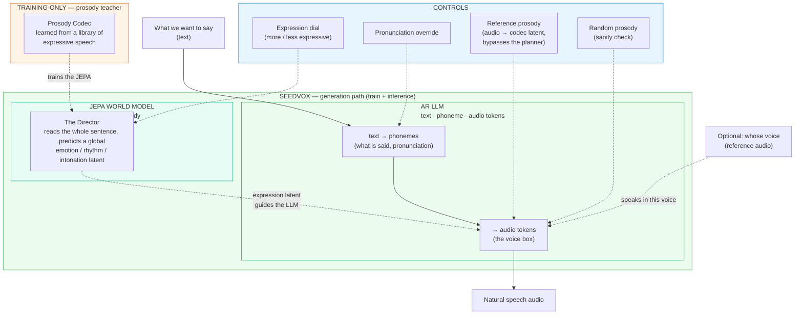
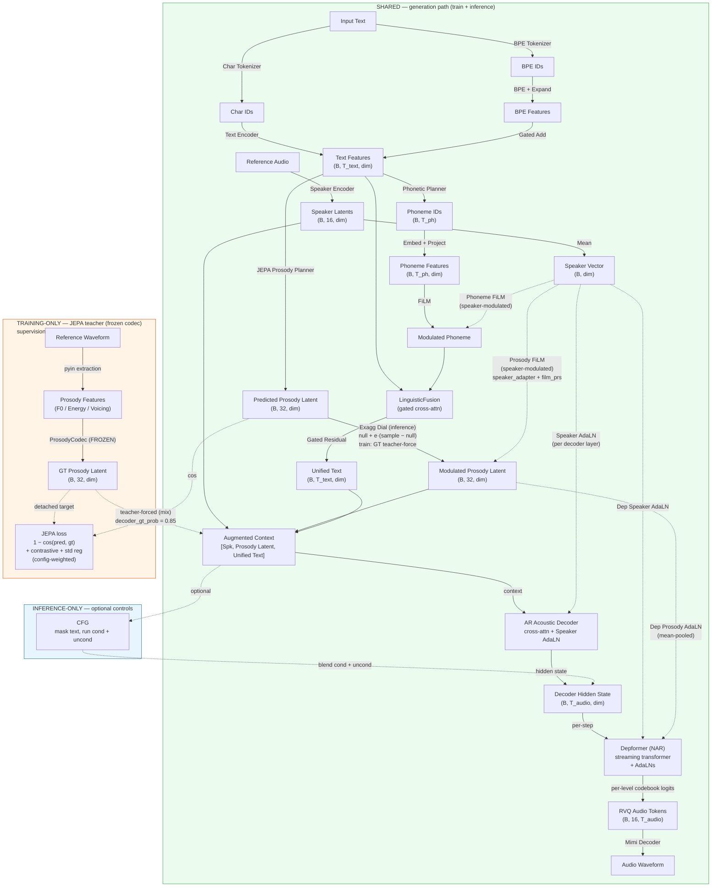
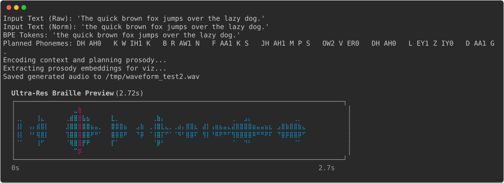

# 🌱 SeedVox

Great AI speech shouldn't just be built bigger. It should also be built smarter — and it should be open for everyone to learn from.
SeedVox is a speech synthesis solution that brings structural discipline back to neural audio, designed as an educational and research sandbox for understanding how machines learn to speak. Instead of forcing a single model to juggle pronunciation, rhythm, and emotion at once, it splits the workload into three specialized components: an **AR Phonetic Planner** for phoneme prediction, a **JEPA World Model** for global prosody planning, and an **AR Acoustic Decoder** for audio token generation. This structured approach trains smarter models that require less hardware and data, making speech generation research accessible on consumer GPUs — a more elegant, frugal, and mathematically sound path to exploring how systems learn to speak.

---

## 🧠 The Motivation: From Brute-Force to Structured Speech

Most modern engines treat human expression like a brute-force math problem — large autoregressive decoders guess emotional state token by token. But human emotion isn't a split-second dice roll; it's a **global state of mind** that shapes an entire sentence before we even open our mouths.

By forcing a single network to calculate pronunciation, rhythm, and emotion at the same millisecond, current solutions require massive hardware clusters to overcome architectural inefficiencies.

**SeedVox solves this by introducing the JEPA Prosody Planner:**

- 🧩 **The "What" (Sequential AR Planning):** A dedicated Autoregressive Transformer handles phonetics and acoustic token generation, ensuring stable, hallucination-free speech anchoring.
- 🎭 **The "How" (JEPA World Model):** A Joint-Embedding Predictive Architecture analyzes the entire semantic context at once, projecting overall expressive intent into a global latent space *before* generation begins.

---

## 🏗️ Architecture

Instead of one giant network juggling everything at once, SeedVox **combines an AR LLM with a JEPA World Model**. The **JEPA World Model** handles emotion and prosody — it reads the full sentence up front and predicts a global expression latent that shapes how the whole utterance should feel. The **AR LLM** handles sequential token generation across **text, phonemes, and audio** — the stable, hallucination-resistant backbone for what is said and how it's pronounced. The JEPA's expression latent guides the AR LLM's audio generation, and a frozen **Prosody Teacher** (codec) trains the JEPA from a library of expressive speech.

### 🗺️ High-Level View


```mermaid
graph TD
    TXT["What we want to say<br/>(text)"]

    subgraph CORE["SEEDVOX — generation path (train + inference)"]
        subgraph JEPA["JEPA WORLD MODEL<br/>emotion · prosody"]
            J["The Director<br/>reads the whole sentence, predicts a global<br/>emotion / rhythm / intonation latent"]
        end

        subgraph LLM["AR LLM<br/>text · phoneme · audio tokens"]
            A["text → phonemes<br/>(what is said, pronunciation)"]
            B["→ audio tokens<br/>(the voice box)"]
            A --> B
        end

        J -.->|"expression latent<br/>guides the LLM"| B
    end

    subgraph TUT["TRAINING-ONLY — prosody teacher"]
        T["Prosody Codec<br/>learned from a library of<br/>expressive speech"]
    end

    subgraph CTL["CONTROLS"]
        C["Expression dial<br/>(more / less expressive)"]
        P["Pronunciation override"]
        R["Reference prosody<br/>(audio → codec latent,<br/>bypasses the planner)"]
        RND["Random prosody<br/>(sanity check)"]
    end

    TXT --> A
    VOI["Optional: whose voice<br/>(reference audio)"] -.->|"speaks in this voice"| B
    T -.->|"trains the JEPA"| J
    C -.-> J
    P -.-> A
    R -.-> B
    RND -.-> B
    B --> OUT["Natural speech audio"]

    style CORE fill:#ebfbee,stroke:#2f9e44
    style JEPA fill:#e6fcf5,stroke:#0ca678
    style LLM fill:#ebfbee,stroke:#2f9e44
    style TUT fill:#fff4e6,stroke:#e8590c
    style CTL fill:#e7f5ff,stroke:#1971c2
```

**Legend:** solid arrows = data flow; dashed arrows = conditioning (the JEPA's expression latent steering the AR LLM), optional inputs, or training supervision.

### 🧬 Detailed Architecture

The model follows a **fusion-based** design: text and phoneme features are fused via cross-attention before acoustic decoding, avoiding the tri-alignment problem of separate modality blocks.

> **Latent, not features.** Everything that conditions generation is a **prosody *latent*** — a learned `(B, 32, dim)` vector predicted by the JEPA planner. Raw F0/Energy/Voicing *features* feed only the frozen stage-1 codec and never enter the generation path directly. At **inference** the decoder conditions on the *sampled* plan; during **training** the GT codec latent is teacher-forced into the decoder (`decoder_prosody_source: "mix"`, 85% GT / 15% sampled) so it learns to follow the latent.


```mermaid
graph TD
    subgraph SH["SHARED — generation path (train + inference)"]
        Text["Input Text"] -->|"Char Tokenizer"| CT["Char IDs"]
        Text -->|"BPE Tokenizer"| BT["BPE IDs"]
        CT -->|"Text Encoder"| TE["Text Features<br/>(B, T_text, dim)"]
        BT -->|"BPE + Expand"| BE["BPE Features"]
        BE -->|"Gated Add"| TE

        RefAudio["Reference Audio"] -->|"Speaker Encoder"| SPK["Speaker Latents<br/>(B, 16, dim)"]
        SPK -->|"Mean"| SL["Speaker Vector<br/>(B, dim)"]

        TE -->|"JEPA Prosody Planner"| PL["Predicted Prosody Latent<br/>(B, 32, dim)"]
        TE -->|"Phonetic Planner"| PH["Phoneme IDs<br/>(B, T_ph)"]
        PH -->|"Embed + Project"| PHE["Phoneme Features<br/>(B, T_ph, dim)"]

        PHE -->|"FiLM"| FPH["Modulated Phoneme"]
        SL -.->|"Phoneme FiLM<br/>(speaker-modulated)"| FPH
        PL -->|"Exagg Dial (inference)<br/>null + e·(sample − null)<br/>train: GT teacher-force"| FPRS["Modulated Prosody Latent<br/>(B, 32, dim)"]

        TE --> LF["LinguisticFusion<br/>(gated cross-attn)"]
        FPH --> LF
        LF -->|"Gated Residual"| UT["Unified Text<br/>(B, T_text, dim)"]

        SPK --> CTX["Augmented Context<br/>[Spk, Prosody Latent, Unified Text]"]
        FPRS --> CTX
        UT --> CTX

        CTX -->|"context"| DEC["AR Acoustic Decoder<br/>cross-attn + Speaker AdaLN"]
        DEC -->|"hidden state"| HID["Decoder Hidden State<br/>(B, T_audio, dim)"]
        HID -->|"per-step"| DEPM["Depformer (NAR)<br/>streaming transformer<br/>+ AdaLNs"]
        DEPM -->|"per-level codebook logits"| RVT["RVQ Audio Tokens<br/>(B, 16, T_audio)"]
        RVT -->|"Mimi Decoder"| WAV["Audio Waveform"]

        SL -.->|"Speaker AdaLN<br/>(per decoder layer)"| DEC
        SL -.->|"Prosody FiLM<br/>(speaker-modulated)<br/>speaker_adapter + film_prs"| FPRS
        SL -.->|"Dep Speaker AdaLN"| DEPM
        FPRS -.->|"Dep Prosody AdaLN<br/>(mean-pooled)"| DEPM
    end

    subgraph TR["TRAINING-ONLY — JEPA teacher (frozen codec)<br/>supervision + decoder teacher-forcing"]
        WavRef["Reference Waveform"]
        PF["Prosody Features<br/>(F0 / Energy / Voicing)"]
        GT["GT Prosody Latent<br/>(B, 32, dim)"]
        JL["JEPA loss<br/>1 − cos(pred, gt)<br/>+ contrastive + std reg<br/>(config-weighted)"]
        WavRef -->|"pyin extraction"| PF
        PF -->|"ProsodyCodec (FROZEN)"| GT
        GT -.->|"detached target"| JL
        PL -.->|"cos"| JL
        GT -.->|"teacher-forced (mix)<br/>decoder_gt_prob = 0.85"| CTX
    end

    subgraph INF["INFERENCE-ONLY — optional controls"]
        CFG["CFG<br/>mask text, run cond + uncond"]
        CTX -.->|"optional"| CFG
        CFG -.->|"blend cond + uncond"| HID
    end

    style TR fill:#fff4e6,stroke:#e8590c
    style INF fill:#e7f5ff,stroke:#1971c2
    style SH fill:#ebfbee,stroke:#2f9e44
```

**Legend:** solid arrows = data flow; dashed arrows = conditioning injection (speaker/prosody), supervision (JEPA loss), or optional controls. 🟢 `SHARED` = generation path (train + inference). 🟠 `TRAINING-ONLY` = frozen codec teacher — the GT latent supervises the JEPA loss AND is teacher-forced into the decoder (85% GT / 15% sampled), so the decoder learns to follow the latent. 🔵 `INFERENCE-ONLY` = sampling-time controls.

### 🔑 Key Design Choices

- 🎭 **JEPA Prosody Planning:** Prosody is a global state of mind, not a token-level dice roll. The JEPA planner consumes the full text at once and emits a learned `(B, 32, dim)` latent that shapes the entire utterance before generation begins. The planner is **stochastic** (learned mean + std head); at inference it samples with `prosody_temperature` instead of emitting a single deterministic point.
- 🪨 **Frozen Codec Teacher:** The planner is supervised by a *frozen* stage-1 `ProsodyCodec` (F0/E/v → latent) through a cosine loss — predicting a latent, not reconstructing features — plus config-weighted contrastive and std regularizers. The GT is detached for the loss and **teacher-forced** into the decoder during training (85% GT / 15% sampled), so the decoder learns to follow the latent; at inference only sampled plans exist.
- 🔒 **Latent, not features:** Raw F0/Energy/Voicing only feed the frozen codec as a training target. Generation conditions exclusively on the learned latent, so the exagg dial moves a real manifold instead of re-fitting features. At inference the dial operates around the **sampled** plan: `null + e·(sample − null)`, where `e=0` is flat and `e>1` exaggerates.
- 🧩 **Unified Linguistic Fusion:** A gated cross-attention layer folds explicit phonemes into the text backbone *before* acoustic generation, giving the decoder a single unified representation to work with.
- 🎛️ **Dual-FiLM Disentanglement:** Two speaker-modulated FiLM adapters condition the streams separately — `film_phn` shapes articulation/vocal tract, `film_prs` shapes rhythm/emotion — so a cloned voice doesn't bleed its recording-environment or emotional style across streams.
- 🌊 **NAR Depformer with AdaLN Conditioning:** The depformer streams the remaining RVQ codebooks in parallel instead of re-decoding them. It sees the decoder hidden state plus two AdaLN injections — a static **speaker** AdaLN and `dep_prosody_adaLN` (mean-pooled) — so high codebooks don't rely on AR cross-attention alone for prosody.
- ⚖️ **Asymmetric Speaker vs. Prosody Conditioning:** Speaker identity is static → AdaLN at both decoder and depformer. Prosody is temporal → the decoder consumes it time-resolved via context cross-attention, while the depformer gets a pooled AdaLN (a mean of a time-varying signal loses timing, so temporal detail lives in the decoder).
- ✍️ **Intervenable Control:** Phonemes are planned explicitly before audio generation, so researchers can overwrite the phoneme string to fix pronunciations or acronyms at runtime.

---

## 📊 Results

Validated end-to-end on real expressive speech, warm-started from an earlier planner checkpoint and trained for a few epochs on a single **24 GB RTX 5090 Laptop GPU**.

**How to read the numbers.** Two units appear in the table:

- `ar` / `gen_ar` are token-prediction losses (average "surprise" in bits per predicted audio token; **lower is better**). Only the *comparison* between the two rows matters.
- `gen_cos` / `gen_cycle` are direction distances, `1 − cos(a, b)`: how much two prosody contours go up and down the same way. **0 = identical**, **1 ≈ unrelated** (roughly what you'd get comparing two different sentences' prosody). `0.24` = "clearly the same contour, not a copy"; `~1` = "no shared direction".

| Metric | Best epoch | Meaning |
|---|---|---|
| `ar` (teacher) | 1.070 | AR token loss under GT-prosody conditioning |
| `gen_ar` | 1.070 | AR token loss decoded under a *sampled* plan |
| `gen_cos` | 0.237 | Distance from generated prosody to GT prosody |
| `gen_cycle` | 0.317 | Distance from generated prosody to the plan it was given |

**Key takeaways**

- **`gen_ar == ar`** (both 1.070) — sampling the plan costs nothing. The decoder predicts audio tokens *just as accurately* from a randomly drawn plan as from ground truth. If it had learned to ignore the plan and read only the text, `gen_ar` would be clearly worse than `ar`. It is not — the latent is genuinely informative, and there is no text-only collapse.
- **`gen_cycle ≈ 0.32`**, nearly matching `gen_cos` at 0.24 — the audio *carries the plan*. Generated prosody lands almost as close to the arbitrary plan it was told to follow as to ground truth itself, so the cycle loss is doing its job. An ignored plan would push `gen_cycle` toward 1 (unrelated).
- **Planner saturation** — continued training improved the acoustic decoder while prosody fidelity (`gen_cos`) stayed flat at ~0.24. Planning is cheap to learn; the bottleneck is audio-token modeling, not the plan.

---

## ⚡ Quick Start (Inference)

```bash
# Basic inference
python -m explicit_pros_phon_planner.infer \
    --config ./configs/light_fusion_r3.json \
    --checkpoint ./checkpoints/seedvox_light_fusion_epoch_103.pt \
    --text "The quick brown fox jumps over the lazy dog." \
    --output output.wav

# Optimized inference with compilation and metrics
python -m explicit_pros_phon_planner.infer \
    --config ./configs/light_fusion_r3.json \
    --checkpoint ./checkpoints/seedvox_light_fusion_epoch_103.pt \
    --text "The quick brown fox jumps over the lazy dog." \
    --compile \
    --log_metrics \
    --play \
    --output output.wav
```


**Example output:**
```
Input Text (Raw): 'The quick brown fox jumps over the lazy dog.'
Input Text (Norm): 'the quick brown fox jumps over the lazy dog.'
BPE Tokens: 'the quick brown fox jumps over the lazy dog.'
Planned Phonemes: DH AH0   K W IH1 K   B R AW1 N   F AA1 K S   JH AH1 M P S   OW2 V ER0   DH AH0   L EY1 Z IY0   D AA1 G .
Encoding context and planning prosody...
Extracting prosody embeddings for viz...
Saved generated audio to output.wav

==============================
Performance Metrics:
  Compilation Time:  8.47s (subsequent runs skip this)
  Planner:           Phonetics 135.3ms; Prosody 11.8ms
  Acoustic Gen:      1707.8ms
  Mimi Decode:       13.6ms
------------------------------
  Total Latency:     1951.6ms
  Audio Duration:    2.88s
  Real-time Factor:  0.6776x
==============================
```

### 🚀 Features
- 🎯 **Deterministic Synthesis**: Use `--seed <INT>` for reproducible results.
- ⚡ **Optimized Inference**: Gradient checkpointing, Fused AdamW, and `torch.compile` keep latencies under 400ms on consumer GPUs (RTX 30/40/50 series).
- 🎭 **N-Variant Generation**: Synthesize multiple variants along the **prosody** (`--variant_axis pros`) or **speaker** (`--variant_axis speaker`) axes to explore the latent space.
- 📊 **High-Resolution Visualization**: Built-in terminal-based waveform renderer.
- 🔧 **LoRA Fine-Tuning**: Adapt the model to new voices or domains with lightweight low-rank adapters. Supports checkpointed LoRA inference via `--lora_checkpoint`.
- ⚙️ **CFG Scale Tuning**: Adjust classifier-free guidance strength with `--cfg_scale` to balance prosody diversity vs. reference fidelity.
- 🌡️ **Temperature Tuning**: Control sampling stochasticity across phoneme planning, prosody planning, and acoustic generation with `--phoneme_temperature`, `--prosody_temperature`, and `--acoustic_temperature`.

---

## 📄 License

Apache License 2.0. See `LICENSE` for details.

For a full technical breakdown, see [`intro_seedvox.md`](intro_seedvox.md).
